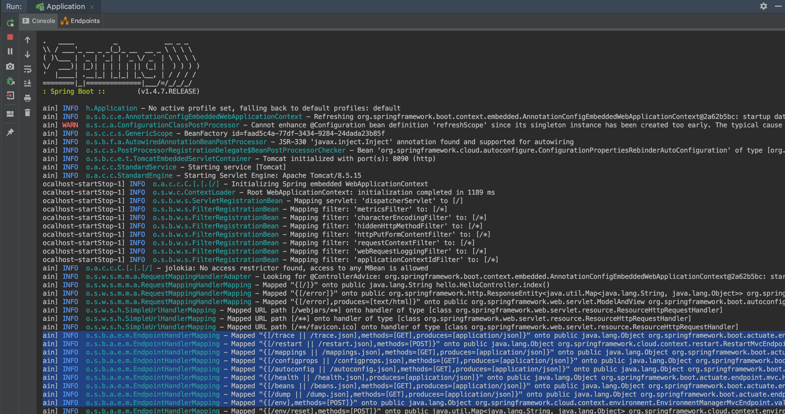

**Actuator Testbed**, a sample vulnerable application exposing Spring Boot Actuators

*Run locally (jdk 8 is recommended, by default binds to localhost:8090):*  
* `mvn install`
* `mvn spring-boot:run`

See https://www.veracode.com/blog/research/exploiting-spring-boot-actuators for attack payloads.

